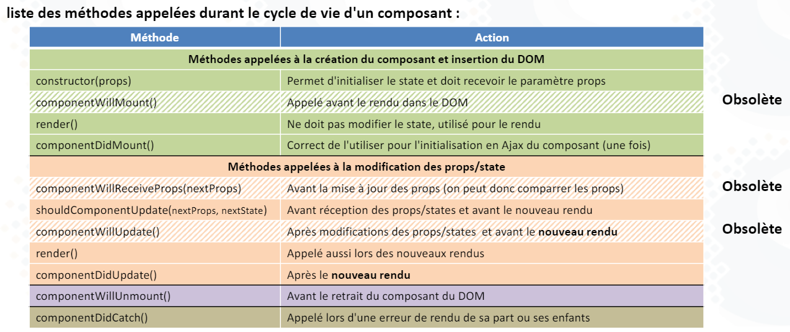

# Les cycles de vie en React

## Dans un composant classe



## Dans un composant fonction
```jsx
//Exécute le useEffect à chaque modification du state
    useEffect(() => {
        console.log("Monté ou modif du state");
    })

    //Exécute useEffect lorsque le composant est monté puisque aucun élément n'est suivi pour le rappeler
    useEffect(() => {
        console.log("Monté");
    }, [])

    //Exécute useEffect au montage ET aux modifications survenant sur la variable compteur
    useEffect(() => {
        console.log("Monté ou modif de valeur surveillée");
    }, [valeurASurveiller])

    //A la destruction du composant
    useEffect(() => {
        return () => {
            console.log("destruction");
        }
    }, [])
```

### exercice:
1. Créer un composant qui affichera "Création" en console à sa création
2. Ce composant doit afficher "Destruction" lorsqu'il est déchargé
3. Dans le composant, deux boutons doivent incrémenter deux compteurs différents
4. Ces compteurs sont affichés dans le titre de l'onglet de la page (document.title)
5. Seul l'un des compteurs met à jour automatiquement le titre de l'onglet, l'autre ne change que dans la page
6. astuce : utiliser un affichage conditionnel dans App.js avec un bouton qui affiche / masque le composant